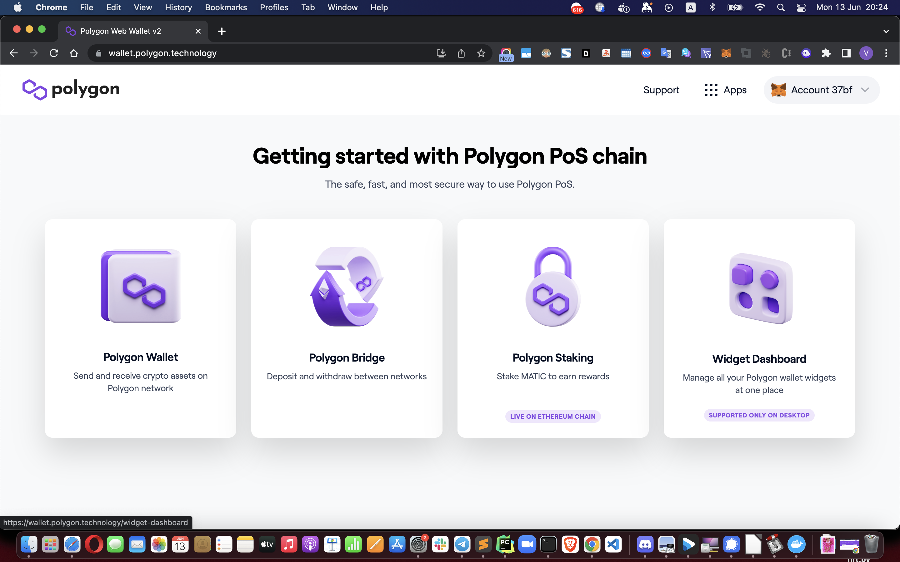
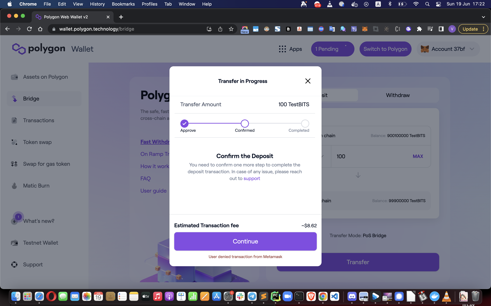
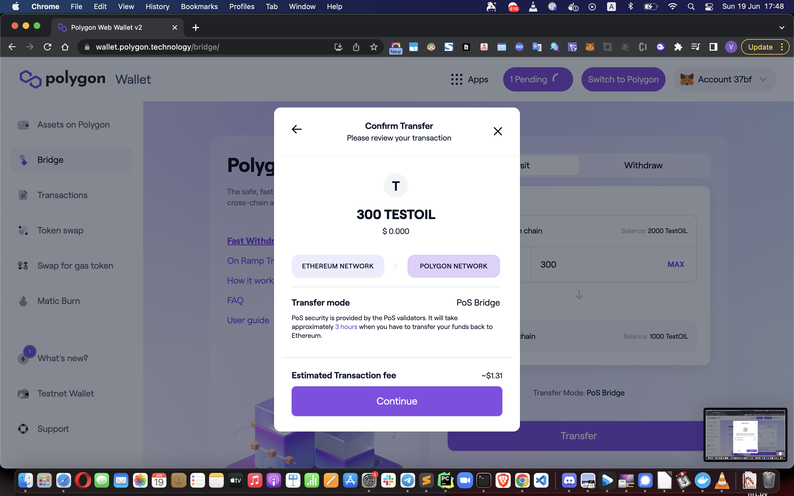
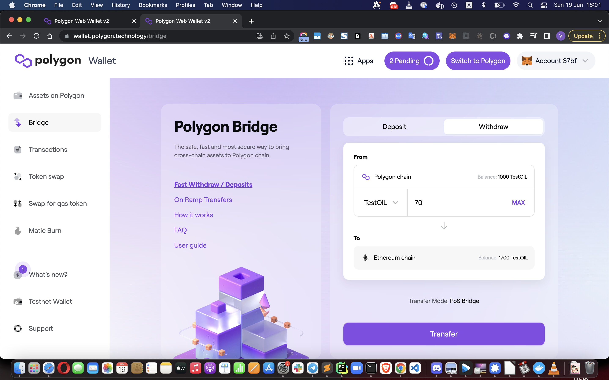

# cryptobots-contracts

https://etherscan.io/address/0x888888848B652B3E3a0f34c96E00EEC0F3a23F72#code

https://bscscan.com/address/0x9fd87aefe02441b123c3c32466cd9db4c578618f#code

https://etherscan.io/address/0x0f5d2fb29fb7d3cfee444a200298f468908cc942#code

https://etherscan.io/address/0x3845badAde8e6dFF049820680d1F14bD3903a5d0#code

https://etherscan.io/address/0xbb0e17ef65f82ab018d8edd776e8dd940327b28b#code

https://etherscan.io/address/0x4d224452801aced8b2f0aebe155379bb5d594381#code

https://etherscan.io/address/0x15D4c048F83bd7e37d49eA4C83a07267Ec4203dA#code

https://bscscan.com/address/0xba5fe23f8a3a24bed3236f05f2fcf35fd0bf0b5c#code

beauty address

https://github.com/ZeframLou/vested-erc20/blob/main/src/VestedERC20.sol

https://eips.ethereum.org/EIPS/eip-1132

## Test

### Setup eth mainnet fork

brownie console --network mainnet-fork

### Run test

brownie test -vvv --coverage -R

## How to bridge BITS between ETH <-> Polygon

TestBITS ETH address = '0x4b90b7AE33A9E88dED786E38Db57D4ee3bD9E611'
TestBITS Child Polygon address = '0x77A2EF40D469219D10191fc25007149b5498eA94'
TestOIL ETH address = '0x970dA6Cd105Fe7aa2B18C904A064401835c723aE'
TestOIL ChildMintable Polygon address = '0xA3ea90482679A2Feb92709EB13a9b774796535F6'

### How to go to the Bridge App

1. Go here https://wallet.polygon.technology/

2. Go to MetaMask and ensure it's connected to Ethereum Mainnet or to Polygon Mainnet.

3. Click "connect wallet" button.

4. Click on the MetaMask button.

5. Click on the "Sign" button in MetaMask.

6. Ensure you see at the top-right corner of the page, that your wallet is connected.

7. Click on "Polygon bridge" button.

### How to transfer BITS from ETH to Polygon

1. Go to the Bridge app (following the previous instruction)

2. Click on the token icon (by default it's Ether, but we need to change it)

3. BITS token is not in the default list, so we need to manually add it.

For TestBITS token the address on ETH blockchain is 0x4b90b7AE33A9E88dED786E38Db57D4ee3bD9E611

paste this address in to the search field.

4. Press "Add custom token" button

The website should fetch the token info from the contract address.

5. Press "Add TestBITS" button.
Now the TestBITS token is in your list in the app and available for selection.

6. Now click the left-arrow button, or close the selection window and open it again.

7. Search for "testbits"

8. Click on TestBITS token. 
 
Now you should see "TestBITS" is selected in the app.

9. Enter some number in the amount field (e.g. 100) and press "Transfer".

10. Press "Continue" button.

11. Press "Continue" button.

12. Press "Continue" button.

13. Press "Approve" button, it's required to be done once to allow Bridge contract to access Funds and allow the transaction in Metamask.

14. Press "Continue" again and approve transaction in Metamask to start Bridging.

15. Then wait for a while to let relayers network to process the bridging to Polygon.

It will take ~7-8 minutes for the deposit to get completed. On completion, your balance will be updated.

Note, that you can see all pending transactions by clicking the button "Pending" at the top of the page.

### How to transfer BITS from Polygon to ETH

Follow the instruction in the previous section, but change FROM and TO blockchains (click withdraw button).

## TestOIL testing log

1. Mint TestOIL on Polygon (child contract) - 0x2aa3e3f16fb42ee9d4fc50ac41be7b85cdaf95b8605d50b1a7afbf41fad32ad6

2. Mint TestOIL on Mainnet (main contract) - 0x821838210b5171f215581f6d681b7e5f8c702915f00fe64b85533bfe5116aff5

3. Bridge from ETH to Polygon

4. Bridge from Polygon to ETH

